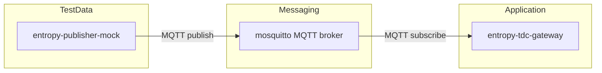
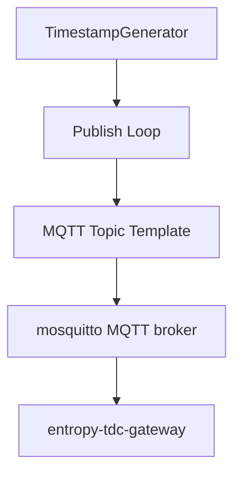
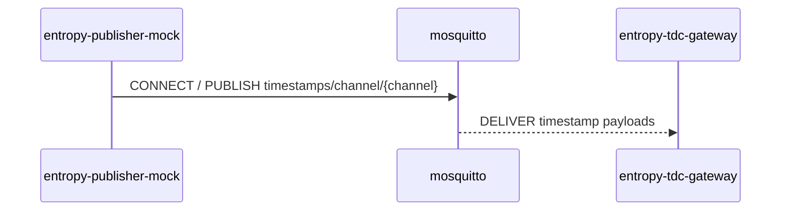

# Entropy Publisher Mock

## Purpose and Scope

The `entropy-publisher-mock` component is a lightweight publisher that emits synthetic time-to-digital converter (TDC) timestamps over MQTT. Its primary role is to provide deterministic, configurable test data for exercising the `entropy-tdc-gateway` without relying on physical TDC hardware. The implementation is intentionally minimal and focuses on reproducible timestamp generation, MQTT publishing, and operational ergonomics for local development and testing.

This documentation describes the internal structure, module boundaries, interfaces, and the component's position in the system architecture, based strictly on the repository contents.

## Responsibilities

1. Generate mock TDC timestamps that emulate 24-bit counter rollover semantics with configurable increments and jitter.
2. Publish generated timestamps to MQTT topics parameterized by channel identifiers.
3. Provide a command-line interface to configure broker connectivity, publishing rate, channel sets, TLS usage, and termination conditions.
4. Offer a Docker image definition for containerized execution and a shell script to orchestrate local startup with Docker Compose and a Python virtual environment.

## Internal Structure and Module Boundaries

The folder is a self-contained Python service with a minimal set of runtime and operational files:

- `entropy-publisher-mock.py`: Primary executable module containing the CLI, timestamp generator, MQTT connection logic, and publish loop.
- `requirements.txt`: Python dependency declaration (`paho-mqtt`).
- `Dockerfile`: Container image definition, including runtime defaults and a non-root user.
- `restart_and_run.sh`: Operational script to restart Docker Compose, wait for the MQTT broker, prepare a local virtual environment, and launch the publisher in the background.
- `__init__.py`: Empty module marker for packaging consistency.
- `venv/`: Local virtual environment directory (not part of the runtime logic).

### Module Responsibilities

- Timestamp generation is encapsulated in the `TimestampGenerator` dataclass, which models fine and coarse counters with rollover behavior consistent with a 24-bit counter.
- Channel parsing and CLI argument specification are confined to `parse_channels` and `build_arg_parser` respectively.
- MQTT connectivity is isolated in `connect_client`, which supports optional authentication and TLS configuration.
- The publish loop (`publish_loop`) manages signal handling, event pacing, and MQTT publishing, including dry-run output and termination conditions.

## Interfaces

### Command-Line Interface

The component is configured entirely through CLI arguments. Key parameters include:

| Parameter | Responsibility | Default |
| --- | --- | --- |
| `--host` | MQTT broker host | `127.0.0.1` |
| `--port` | MQTT broker port | `1883` |
| `--username` / `--password` | MQTT authentication | unset |
| `--client-id` | MQTT client identifier | `mock-tdc-publisher` |
| `--topic` | Topic template with `{channel}` placeholder | `timestamps/channel/{channel}` |
| `--channels` | Channel list or ranges | `1` |
| `--qos` | MQTT QoS level | `0` |
| `--retain` | MQTT retain flag | disabled |
| `--rate` | Events per channel per second | `20.0` |
| `--max-events` | Stop after N events (0 = infinite) | `0` |
| `--increment-ps` | Nominal increment in picoseconds | `1000` |
| `--jitter-ps` | Random jitter in picoseconds | `0` |
| `--tls-ca` | CA file path enabling TLS | unset |
| `--insecure` | Skip TLS verification | disabled |
| `--dry-run` | Print payloads without MQTT | disabled |

### MQTT Topics and Payloads

The publisher emits a string-encoded integer timestamp per event. Topics are generated by formatting the topic template with a channel identifier (for example, `timestamps/channel/1`). The default Docker image command targets a broker named `mosquitto` and publishes to channels `1-2` with a fixed rate and increment/jitter settings.

## Integration in the System Architecture

Within the containerized system, `entropy-publisher-mock` is defined as a test/mock service in `compose/services/test/entropy-publisher-mock.yml` and included in the top-level `docker-compose.yml`. The service depends on the MQTT broker (`mosquitto`) and is intended to supply test data to the `entropy-tdc-gateway` as indicated by the module-level documentation.

The overall architectural placement can be summarized as a data source that replaces physical TDC hardware during development and testing, while maintaining the same MQTT interface expected by downstream consumers.

### Component Relationships

### Data Flow

### Service Interaction Perspective

## Deployment and Execution Context

- The Docker image is built from `entropy-publisher-mock/Dockerfile`, installs `paho-mqtt`, and runs as UID/GID `65534:65534`.
- The default container command publishes to the broker host `mosquitto` on port `1883` with explicit rate and timing parameters.
- The `restart_and_run.sh` script provides a local workflow that restarts the Docker Compose stack, waits for the broker health check, prepares a Python virtual environment, installs dependencies from `requirements.txt`, and starts the publisher process with output redirected to a log file.

## Constraints and Assumptions

- The publisher is designed for development and testing scenarios where synthetic data is acceptable.
- MQTT connectivity is required unless `--dry-run` is used.
- TLS is optional and activated only when a CA file is provided.

## Reproducibility Notes for Academic Use

For repeatable experiments, use fixed `--increment-ps`, `--jitter-ps`, and `--rate` values. The CLI interface provides full control over timestamp emission, channel distribution, and termination conditions, enabling deterministic workload generation for gateway validation and integration testing.
